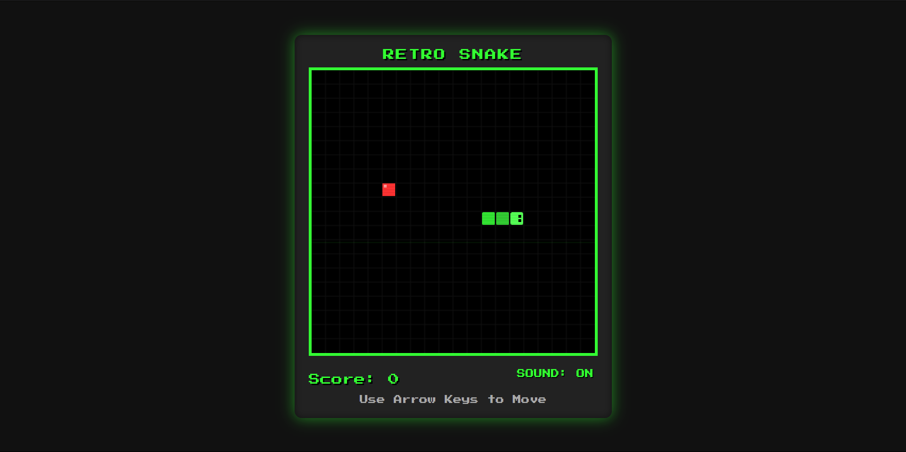

# 🐍 Retro Snake Game

A classic Snake game with a retro arcade aesthetic, smooth controls, and modern web technologies.

## 🎮 Play Now

1. Clone this repository
2. Open `src/main/snake.html` in your browser
3. Use arrow keys to control the snake
4. Eat the red food to grow and increase your score
5. Don't hit the walls or yourself!

## ✨ Features

- **Retro Arcade Styling**: CRT screen effect, pixel font, and classic green-on-black color scheme
- **Smooth Controls**: Direction queue system ensures responsive movement
- **Mobile Support**: Touch/swipe controls for playing on mobile devices
- **Retro Sound Effects**: 8-bit style sounds with mute option
- **Progressive Difficulty**: Game speeds up as your score increases
- **Visual Polish**: Gradient-colored snake body, rounded corners, and eye animation

## 🎮 Controls

- **Arrow Keys**: Change snake direction
- **Space**: Restart game after game over
- **M**: Toggle sound on/off
- **Touch**: Swipe in the direction you want to move (mobile)

## 🔧 Technical Implementation

The game uses modern JavaScript with a modular design pattern:

- **Modular Architecture**: Separated concerns for easier maintenance
  - `game.js`: Core game logic and state management
  - `renderer.js`: All visual rendering with performance optimizations
  - `input-handler.js`: Input handling for keyboard and touch
  - `sound-fx.js`: Audio generation and management

- **Performance Optimizations**:
  - Pre-rendered grid for better performance
  - RequestAnimationFrame for smooth animation
  - Efficient collision detection
  - Direction queue for responsive controls

## 🚀 Future Improvements

Some ideas for future enhancements:

- Leaderboard with localStorage
- Multiple difficulty levels
- Power-ups and obstacles
- Different game modes (maze, time attack)
- Customizable snake appearance

## 📝 License

This project is open source and available under the MIT License.

## 🙏 Credits

- Font: Press Start 2P from Google Fonts
- Sound effects: Generated using Web Audio API
- Inspired by classic Nokia Snake game

---

Made with ❤️ and JavaScript 